# Árbol B+ - Diseño completo

---

## Tabla de Contenidos

- [¿Qué es un Árbol B+?](#qué-es-un-árbol-b)
- [Propiedades Formales](#propiedades-formales)
- [Nuestro caso: t = 2](#nuestro-caso-t--2)
- [Inserciones](#inserciones)
- [Búsquedas](#búsquedas)
- [Eliminaciones](#eliminaciones)
- [Análisis de complejidad Big-O](#análisis-de-complejidad-big-o)
- [¿Por qué usar árboles B+ en sistemas reales?](#por-qué-usar-árboles-b-en-sistemas-reales)

---

## ¿Qué es un Árbol B+?

Un **árbol B+** es una estructura de datos de búsqueda balanceada y autoorganizable, diseñada para trabajar eficientemente con grandes volúmenes de datos almacenados en disco. Es una variante del árbol B donde todos los datos reales se almacenan únicamente en las hojas, y los nodos internos actúan exclusivamente como índices de navegación.

Trabajamos con un árbol B+ de `t = 2`, es decir, cada nodo tanto hoja como interno puede tener hasta **3 claves** y debe tener al menos **1 clave**, excepto la raíz. Las hojas están enlazadas secuencialmente para recorridos rápidos.

---

## Propiedades Formales

Dado un árbol B+ de orden `m`:

| Propiedad | Descripción |
|-----------|-------------|
| **Capacidad máx. de hijos** | Cada nodo interno puede tener como máximo `m` hijos |
| **Capacidad máx. de claves** | Cada nodo puede tener como máximo `m − 1` claves |
| **Ocupación mínima** | Cada nodo interno (excepto la raíz) debe tener al menos `⌈m/2⌉` hijos, garantizando que ningún nodo esté demasiado vacío |
| **Ordenamiento** | Dentro de un nodo las claves se ordenan: `k₁ < k₂ < … < kₙ` |
| **Balanceo perfecto** | Todas las hojas se encuentran exactamente en el mismo nivel. El árbol crece hacia **arriba** (desde las hojas hacia la raíz), no hacia abajo |
| **Estructura de búsqueda** | Para cualquier clave `Kᵢ` en un nodo: todas las claves del subárbol izquierdo son `< Kᵢ`, y todas las del subárbol derecho son `≥ Kᵢ` |
| **Hojas enlazadas** | A diferencia del árbol B clásico, las hojas están conectadas entre sí en una lista enlazada, permitiendo recorridos secuenciales sin volver a la raíz |

---

## Nuestro caso: t = 2

Trabajamos con un árbol B+ de `t = 2`, lo que equivale a un orden `m = 4` (relación general: `m = 2t`).

| Parámetro | Valor |
|-----------|-------|
| Máximo de claves por nodo | `m − 1 = 3` |
| Máximo de hijos por nodo interno | `m = 4` |
| Mínimo de claves (nodos internos) | `⌈m/2⌉ − 1 = 1` |
| Mínimo de hijos (nodos internos) | `⌈m/2⌉ = 2` |

> **Claves utilizadas:** rutas de directorios Unix (`/bin`, `/etc`, `/home`…), ordenadas **alfabéticamente**, para simular cómo un sistema de archivos real podría indexar sus directorios.

---

## Inserciones

Cada inserción sigue estos principios:

1. Se busca la **hoja** donde debe ir la nueva clave.
2. Si la hoja **no se llena** (`≤ 3` claves), se inserta ordenadamente y listo.
3. Si se **llena** (4 claves), se divide la hoja en dos, promocionando la primera clave de la nueva hoja derecha al padre.
4. Si el padre también se llena al recibir la clave, se repite la división hacia arriba.

Esto garantiza que el árbol siempre esté balanceado.

---

### Paso 1 — Insertar `/home`, `/etc`, `/var`

El árbol está vacío, por lo que el primer nodo que se crea es una hoja raíz. Los directorios se insertan ordenadamente alfabéticamente:

- El árbol sigue siendo una sola hoja con 3 elementos, dentro del límite.
- **No hay divisiones.**

  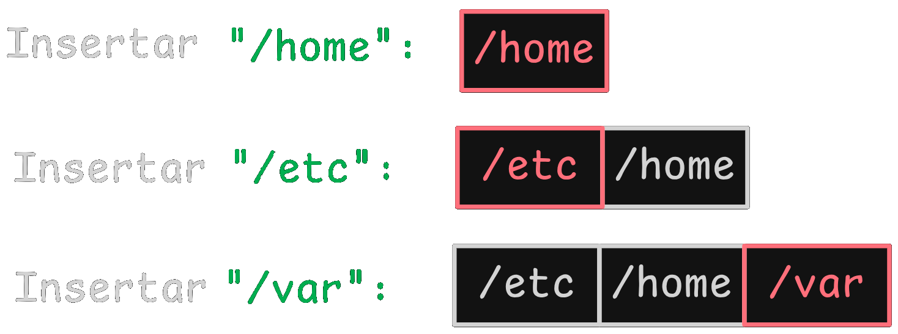

---

### Paso 2 — Insertar `/usr`

Como `/usr < /var` (alfabéticamente), se inserta antes de `/var`. La hoja pasa a tener 4 claves, lo que **excede el máximo permitido (3)**. Esto provoca un desborde y se debe dividir la hoja.

  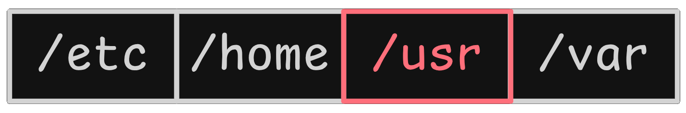

**Procedimiento de división de hoja:**

1. Se elige un punto de división: con 4 claves y máximo 3, la división natural deja **2 claves a la izquierda** y **2 a la derecha** (balanceamos).
2. Las primeras dos claves (`/etc`, `/home`) forman la **hoja izquierda**.
3. Las últimas dos (`/usr`, `/var`) forman la **hoja derecha**.
4. Se **promociona la primera clave de la hoja derecha** (`/usr`) al nodo padre. Como no había padre, se crea un nuevo nodo interno que será la raíz.

  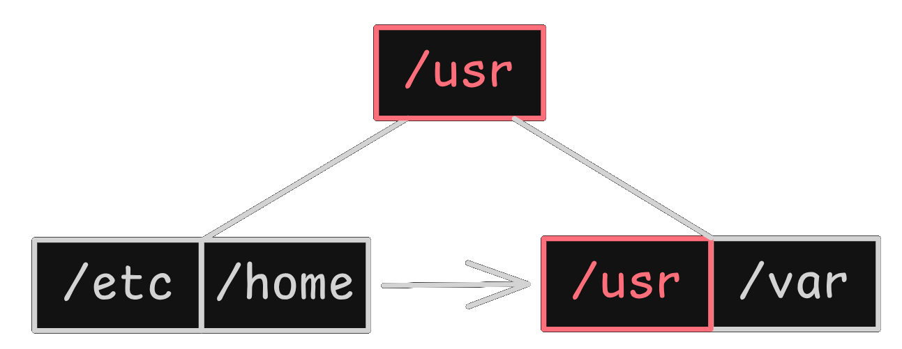

---

### Paso 3 — Insertar `/bin`

Como `/bin < /usr`, se baja por la izquierda hacia la hoja `[/etc, /home]`. Se inserta ordenadamente: `[/bin, /etc, /home]`.

- La hoja tiene 3 claves (máximo permitido).
- **No hay desborde.** El árbol mantiene la misma estructura.

  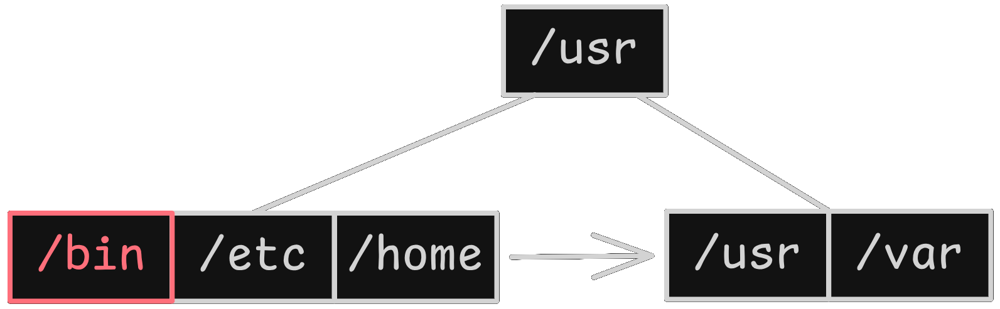

---

### Paso 4 — Insertar `/tmp`

Como `/tmp < /usr`, se va a la hoja izquierda `[/bin, /etc, /home]`. Al insertar `/tmp` (después de `/home`) se obtiene `[/bin, /etc, /home, /tmp]` → **4 claves, desborde**.

  

**División de hoja:**

1. **Hoja izquierda:** `[/bin, /etc]` (2 claves)
2. **Hoja derecha:** `[/home, /tmp]` (2 claves)
3. Se promociona `/home` (primera clave de la derecha) al padre.

**Padre antes:** `[/usr]` (1 clave, 2 hijos)
**Padre después:** inserta `/home` → `[/home, /usr]` (2 claves, 3 hijos). Como el máximo en nodos internos también es 3, aún está dentro de rango.

Los hijos quedan ordenados: primero los menores que `/home`, luego entre `/home` y `/usr`, luego mayores que `/usr`. Las hojas se enlazan consecutivamente.

  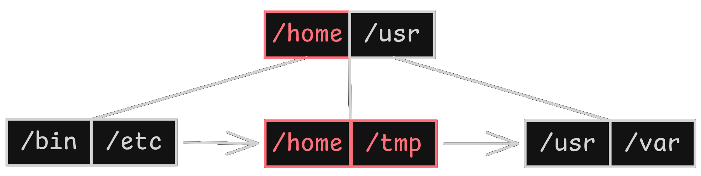

---

### Paso 5 — Insertar `/opt`

Se compara con la raíz: `/opt` está entre `/home` y `/usr`, por lo que se va al hijo del medio: la hoja `[/home, /tmp]`. Se inserta ordenadamente: `[/home, /opt, /tmp]`.

- 3 claves → **no hay desborde**.

  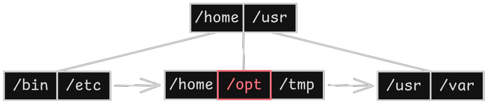

---

### Paso 6 — Insertar `/lib`

Como `/lib` también está entre `/home` y `/usr`, se va a la hoja `[/home, /opt, /tmp]`. Al insertar: `[/home, /lib, /opt, /tmp]` → **4 claves, desborde**.

**División de hoja:**

1. **Hoja izquierda:** `[/home, /lib]`
2. **Hoja derecha:** `[/opt, /tmp]`
3. Se promociona `/opt`.

El padre `[/home, /usr]` recibe `/opt` y queda `[/home, /opt, /usr]` (3 claves, 4 hijos), que es exactamente el máximo permitido (`m − 1 = 3` claves, `m = 4` hijos). **El padre no se desborda.**

  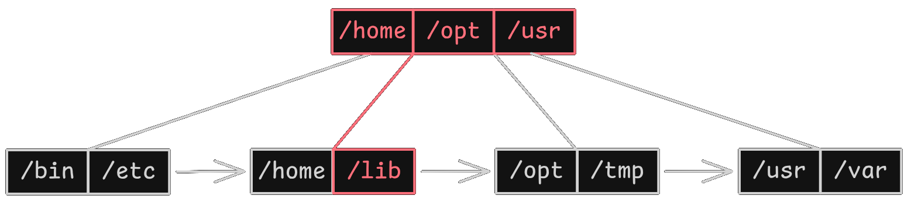

---

## Búsquedas

Para encontrar un dato, el árbol siempre empieza desde arriba y toma decisiones "menor que" o "mayor/igual que" en cada nodo.

---

### Búsqueda exitosa: `/lib`

**1. En la Raíz `[/home, /opt, /usr]`:**
- ¿Es `/lib < /home`? No (L > H). No bajamos por el primer hijo.
- ¿Es `/lib < /opt`? Sí (L < O).
- **Decisión:** como está entre `/home` y `/opt`, bajamos por el **segundo hijo**.

**2. En la Hoja `[/home, /lib]`:**
- El sistema lee este nodo desde disco o memoria.
- `/home` → No es, se descarta.
- `/lib` → **Encontrado.**

  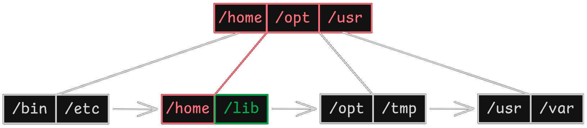

---

### Búsqueda fallida: `/proc` (clave inexistente)

**1. En la Raíz `[/home, /opt, /usr]`:**
- ¿Es `/proc < /home`? No (P > H).
- ¿Es `/proc < /opt`? Sí (P < O).
- **Decisión:** está entre `/home` y `/opt`, bajamos por el **segundo hijo**.

**2. En la Hoja `[/home, /lib]`:**
- Se lee el nodo completo.
- `/home` → No es, se descarta.
- `/lib` → No es, se descarta.
- No hay más claves en este nodo y no existe un siguiente nodo donde pueda estar (la siguiente hoja empieza en `/opt`, que ya es mayor que `/proc`).
- **`/proc` NO encontrado.**

  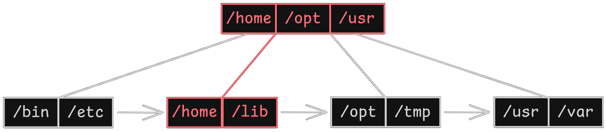

**¿Por qué es importante este caso?**

La búsqueda fallida demuestra dos aspectos clave del árbol B+:

- **Eficiencia garantizada:** el árbol nunca recorre nodos innecesarios. En cuanto agota las claves del nodo hoja correspondiente sin encontrar el valor, termina. No sigue explorando otras ramas.
- **Determinismo:** siempre se llega exactamente a la hoja donde debería estar la clave si existiera. No hay ambigüedad ni búsqueda exhaustiva como en una lista.

---

## Eliminaciones

Las eliminaciones son más complejas porque pueden provocar **subdesborde** (menos del mínimo de 1 clave). Para resolverlo:

- Si la hoja queda con al menos **1 clave**, simplemente actualizamos el separador en el padre si la clave eliminada era la primera de la hoja.
- Si la hoja queda **vacía** (0 claves):
  - Se miran sus hermanos adyacentes (izquierdo o derecho).
  - Si un hermano tiene **más del mínimo** (más de 1 clave), se le pide prestada una clave, redistribuyendo las claves y ajustando el separador del padre.
  - Si ambos hermanos tienen solo el mínimo, se **fusiona** la hoja vacía con un hermano (se juntan las claves y se elimina la hoja vacía). Luego se elimina una clave del padre (el separador entre ellas) y un puntero hijo.
  - Si el padre queda con déficit (0 claves), puede ser necesario **reducir la altura** del árbol.

---

### Estado inicial antes de eliminar

El árbol parte del estado final de las inserciones:

  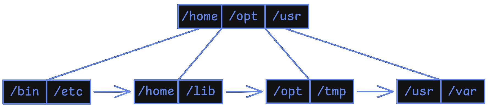

---

### Eliminar `/usr`

Se busca `/usr`: va por la derecha, llega a la hoja `[/usr, /var]`. Se elimina `/usr`. La hoja queda `[/var]` con **1 clave, justo el mínimo. Sin subdesborde.**

Sin embargo, la hoja cambió su primera clave: antes era `/usr`, ahora es `/var`. Esto **invalida el separador** `/usr` en el padre. Se debe actualizar el separador en el nodo interno para que refleje correctamente la primera clave de esa hoja.

- **Antes:** `[/home, /opt, /usr]` con hijos `→ [/usr, /var]`
- **Después:** `[/home, /opt, /var]` con hijos `→ [/var]`

> La clave `/usr` desaparece completamente del árbol. El separador en el padre ahora es `/var`, que es la primera clave real de ese subárbol.

  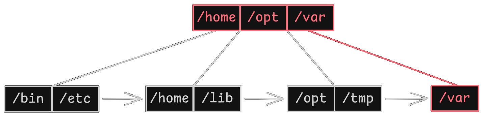

---

### Eliminar `/opt`

`/opt` se encuentra en la hoja `[/opt, /tmp]`. Se elimina y la hoja queda `[/tmp]`. **Mínimo 1 clave, sin subdesborde.**

Se actualiza el separador correspondiente en el padre: el separador `/opt` (entre los hijos `[/home, /lib]` y `[/opt, /tmp]`) ahora debe ser `/tmp`, porque `/tmp` es la nueva primera clave de esa hoja.

- **Raíz cambia de:** `[/home, /opt, /var]` → `[/home, /tmp, /var]`

  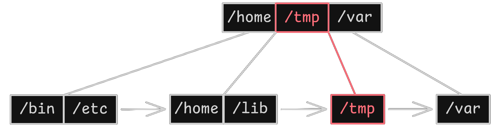

---

### Eliminar `/var`

`/var` está en la hoja `[/var]` (la de más a la derecha). Al borrar, la hoja queda **vacía → subdesborde**.

**Paso 1 — Préstamo:**
- Se mira a la hermana izquierda: la hoja `[/tmp]`. Tiene solo **1 clave** (`/tmp`), que es el mínimo. No puede prestar sin quedar ella misma por debajo del mínimo.
- No existe hermana derecha.
- **No se puede pedir prestado.**

**Paso 2 — Fusión:**
- Se fusiona la hoja vacía con su hermana izquierda `[/tmp]`.
- Al unir los contenidos (`[/tmp]` + vacía), el resultado es una única hoja con `[/tmp]`.
- La hoja vacía se elimina físicamente del árbol y los punteros se reasignan.

**Paso 3 — Ajuste en el padre:**
- El padre `[/home, /tmp, /var]` tenía un separador `/var` entre los hijos correspondientes a las hojas `[/tmp]` y `[/var]`. Al fusionarse, ese separador deja de ser necesario y se elimina junto con el puntero al hijo derecho.
- El padre pasa de **3 claves y 4 hijos** a **2 claves y 3 hijos**: `[/home, /tmp]`.

  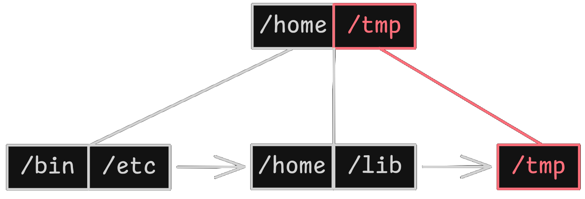

---

### Eliminar `/tmp`

Se busca `/tmp` en la última hoja. Al eliminarlo, la hoja queda **vacía → subdesborde**.

**Paso 1 — Préstamo:**
- Se mira a la hermana izquierda `[/home, /lib]`. Tiene **2 claves**; si presta una se quedaría en el mínimo (1), lo cual sigue siendo válido.
- En esta implementación se aplica la política de **fusionar siempre que sea posible**, priorizando la compactación del árbol sobre el préstamo.

**Paso 2 — Fusión:**
- Se fusiona la hoja vacía con su hermana izquierda `[/home, /lib]`.
- El resultado es la hoja `[/home, /lib]`.

**Paso 3 — Ajuste en el padre:**
- El separador `/tmp` en la raíz ya no apunta a nada, por lo que se elimina.
- La raíz pasa de **2 claves** a **1 clave**: `[/home]`.

  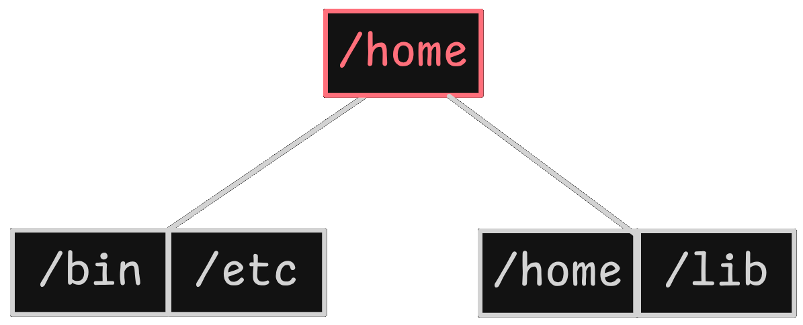

---

### Eliminar `/lib`

Se busca `/lib` en la hoja `[/home, /lib]`. Al eliminarlo, la hoja queda con **1 sola clave: `[/home]`**.

- Todavía tiene el mínimo (1 clave) → **no hay subdesborde**.
- El árbol se mantiene con la raíz `[/home]` y dos hojas: `[/bin, /etc]` y `[/home]`.

  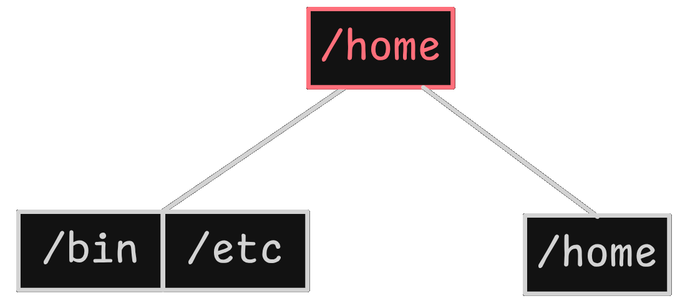

---

### Eliminar `/home`

Se elimina `/home` de la hoja `[/home]`. La hoja queda **vacía → subdesborde**.

**Paso 1 — Préstamo:**
- Se mira a la hermana izquierda `[/bin, /etc]`. Tiene **2 claves**, más que el mínimo → **se puede pedir prestado**.

**Paso 2 — Movimiento:**
- Se mueve la **última clave del hermano izquierdo** (`/etc`) a la hoja vacía.
- La hoja izquierda queda como `[/bin]` y la hoja que estaba vacía ahora tiene `[/etc]`.

**Paso 3 — Actualizar el padre:**
- Como la hoja de la derecha ahora empieza con `/etc`, se actualiza el separador en la raíz.
- **Raíz cambia de:** `[/home]` → `[/etc]`

  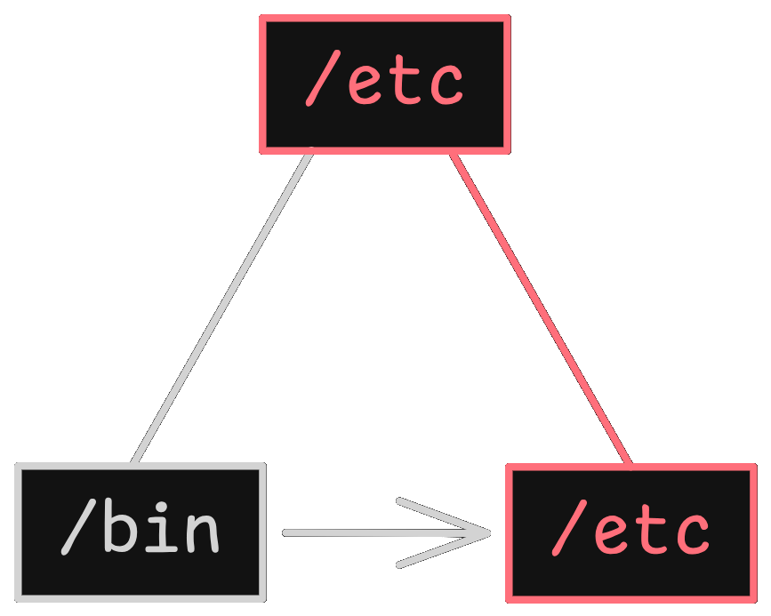

---

### Eliminar `/etc`

Se elimina `/etc` de su hoja. La hoja queda **vacía → subdesborde**.

**Paso 1 — Préstamo:**
- El hermano izquierdo `[/bin]` solo tiene **1 clave** → no puede prestar.

**Paso 2 — Fusión:**
- Se fusiona la hoja vacía con `[/bin]`.
- La hoja resultante es `[/bin]`.

**Paso 3 — Colapso de Raíz:**
- En el padre, se elimina el separador `/etc`. La raíz se queda **sin claves**.
- Como una raíz interna no puede estar vacía si hay datos, el árbol **reduce su altura**.
- El único hijo `[/bin]` sube y se convierte en la **nueva hoja raíz**.

  

---

## Análisis de complejidad Big-O

Dos variables aparecen en todo el análisis:

- **n** → número de claves almacenadas en el árbol
- **h** → altura del árbol, que siempre es **O(log n)** gracias al balanceo automático

La altura es el factor clave porque todas las operaciones empiezan en la raíz y bajan nivel por nivel. En cada nodo se hace una búsqueda lineal entre las claves del nodo, pero como el máximo de claves por nodo es 3 (una constante fija en `t = 2`), esa búsqueda cuesta O(1). Lo que escala con `n` es únicamente la cantidad de niveles que se recorren.

---

### Búsqueda

Buscar una clave siempre sigue el mismo camino: partir de la raíz, comparar en cada nodo interno para elegir el hijo correcto, y llegar a la hoja donde debería estar la clave. Son exactamente `h` pasos, uno por nivel.

**O(log n)**

Esto vale tanto para búsquedas exitosas como fallidas. En ambos casos el árbol llega exactamente a la hoja donde debería estar la clave y no recorre nada más.

---

### Inserción

Insertar una clave tiene dos fases. Primero, bajar hasta la hoja correcta: igual que una búsqueda, cuesta O(log n). Segundo, si la hoja se llena, dividirla y promocionar una clave al padre. En el peor caso esa división se propaga nivel por nivel hasta la raíz, pero hay como máximo `h` niveles y cada división cuesta O(1) (mover 3 claves como máximo). En total, la propagación también es O(log n).

**O(log n)**

---

### Eliminación

Eliminar sigue el mismo patrón: bajar hasta la hoja en O(log n) y luego, si hay subdesborde, resolver con préstamo o fusión. Al igual que las divisiones en inserción, las fusiones pueden propagarse hacia arriba en cascada, pero nunca más allá de `h` niveles. Cada fusión o préstamo cuesta O(1). En total:

**O(log n)**

---

### Recorrido en orden (mostrar todas las hojas)

Mostrar todas las claves en orden aprovecha la lista enlazada de hojas: primero se baja hasta la hoja más a la izquierda (O(log n)) y después se recorre cada hoja siguiendo los punteros `sigHoja` hasta el final. Si hay `n` claves distribuidas en las hojas, recorrerlas todas cuesta O(n).

**O(n)**

---

### Resumen

| Operación | Complejidad | Por qué |
|-----------|:-----------:|---------|
| Búsqueda | O(log n) | Se recorre un camino raíz → hoja de h niveles |
| Inserción | O(log n) | Bajada + divisiones en cascada, máximo h niveles |
| Eliminación | O(log n) | Bajada + fusiones/préstamos en cascada, máximo h niveles |
| Recorrido en orden | O(n) | Hay que visitar las n claves en las hojas |
| **Espacio total** | **O(n)** | Cada clave ocupa un lugar en exactamente una hoja |

---

## ¿Por qué usar árboles B+ en sistemas reales?

Los árboles B+ se diseñaron específicamente para **minimizar las operaciones de entrada/salida en disco**, que son el cuello de botella en bases de datos y sistemas de archivos.

| Ventaja | Detalle |
|---------|---------|
| **Altura reducida** | Almacenar muchas claves por nodo (típicamente cientos) reduce la altura del árbol, de modo que una búsqueda requiere pocos accesos a disco (3–4 niveles para millones de registros) |
| **Pocos accesos a disco** | Cada nivel del árbol equivale a un acceso a disco; menos niveles = menos I/O |
| **Recorridos secuenciales eficientes** | Las hojas enlazadas permiten recorridos secuenciales ideales para listar directorios o ejecutar consultas con `ORDER BY` |
| **Autobalanceo** | Garantiza un rendimiento predecible incluso con inserciones y eliminaciones masivas |

### Sistemas que lo utilizan

- **Sistemas de archivos:** NTFS, HFS+, Btrfs
- **Bases de datos:** MySQL/InnoDB, PostgreSQL

---